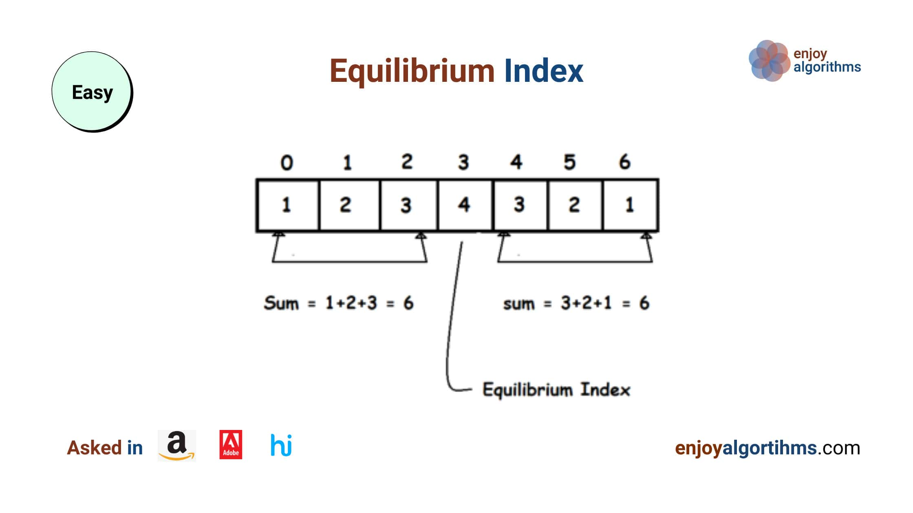

# Tìm chỉ mục cân bằng trong mảng



- Mức độ: Dễ
- Hỏi bởi: Amazon, Adobe, Hike
- Ghi nhớ: Một vấn đề tốt cần học để giải quyết vấn là luôn tối ưu hoá từng bước với biến và vòng lặp.

## Hiểu vấn đề

Viết một chương trình tìm chỉ mục cân bằng của mảng. Chỉ mục cân bằng là một chỉ mục mà tổng các phần tử ở phía trước nó (có chỉ mục nhỏ hơn) bằng với tổng các phần tử ở phía sau nó (có chỉ mục lớn hơn). Nói cách, chỉ mục `i` là chỉ mục cân bằng khi tổng các chỉ mục từ `0` đến `i-1` bằng với tổng các chỉ mục từ `i+1` đến `n-1` (n là độ dài mảng).

> A[0] + A[1] + ... + A[i-1] = A[i+1] + ... + A[n-1], với 0 <= i <= n-1

### Lưu ý

- Với i =0, ta giả sử tổng các phần tử trước nó = 0
- Với i = n-1, ta giả sử tổng các phần tử sau nó = 0

### Ví dụ 1

Input: A[] = [-7, 1, 5, 2, -4, 3, 0]; Output: 3

Giải thích: Vì tại chỉ mục 3: A[0] + A[1] + A[2] = A[4] + A[5] + A[6] = -1

### Ví dụ 2

Input: A[] = [0, 1, 3, -2, -1]; Output: 1

Giải thích: Vì tại chỉ mục 1: A[0] = A[2] + A[3] + A[4] = 0

### Ví dụ 3

Input: A[] = [1, 2, -2, -1]; Output: -1

Không có chỉ mục cân bằng

## Giải pháp

- Phương pháp brute force với các vòng lặp lồng nhau
- Dùng tiền tố với một vòng lặp
- Phương pháp hiệu quả với một vòng lặp

### 1. Brute force

#### Ý tưởng

Cách tiếp cận cơ bản là đi đến từng chỉ mục `i` tìm tổng các phần tử ở bên trái và bên phải, so sánh chúng và nếu chúng bằng nhau thì đó là chỉ mục cân bằng.

Ta sẽ cần các vòng lặp lồng nhau để triển khai giải pháp này: một vòng lặp bên ngoài cho từng chỉ mục `i` và một vòng lặp bên trong để xác định `i` có là chỉ mục cân bằng hay không bằng cách tính tổng hai phía. Ta sẽ cần hai biến bổ sung là:
- `leftSum` để lưu tổng các phần tử bên trái chỉ mục hiện tại.
- `rightSum` để lưu tổng các phần tử bên phải chỉ mục hiện tại.

#### Các bước

1. Ta khai báo biến `leftSum` và `rightSum`.
2. Bây giờ ta chạy một vòng lặp `i` từ 0 đến n-1. Trong vòng lặp ta tìm tổng các phần tử ở cả hai phía của chỉ mục hiện tại.
    - Ta tạo `leftSum` bằng 0 và chạy vòng lặp `j` từ 0 đến i-1 để tính `leftSum`.
    ```c
    for (int j = 0; j < i; j++)
        leftSum = leftSum + A[j];
    ```
    - Ta tạo `rightSum` tương tự nhưng phạm vi sẽ là tử i+1 đến n-1
    ```c
    for (int j = i+1; j < n-1; j++)
        rightSum = rightSum + A[j];
    ```
    - Nếu leftSum và rightSum bằng nhau, chỉ mục hiện tại `i` sẽ là chỉ mục cân bằng và ta trả về nó.
    ```c
    if (leftSum === rightSum)
        return i;
    ```
3. Kết thúc vòng lặp bên ngoài ta trả về -1 vì không tìm thấy bất kỳ chỉ mục cân bằng nào.

#### Mã giả

```c
int equilibriumIndex(int A[], int n) {
    int leftSum, rightSum;
    for(int i = 0; i < n; i++) {
        leftSum = 0;
        for (int j = 0; j < i; j++)
            leftSum = leftSum + A[j];

        rightSum = 0;
        for (int j = i+1; j < n-1; j++)
            rightSum = rightSum + A[j];

        if (leftSum === rightSum)
            return i; 
    }
    return -1;
}
```

#### Phân tích

Ta cần chạy vòng lặp và tính `leftSum` và `rightSum` với mọi `i`. Trong vòng lặp bên ngoài, tổng các toán tử thiết yêu sẽ xác định độ phức tạp thời gian của giải pháp:
- Vòng lặp bên trong đầu tiên từ j = 0 đến i -1. Tổng toán tử = i
- Vòng lặp bên trong thứ hai từ j = i + 1 đến n -1. Tổng toán tử = n - i - 1
- Tổng toán tử của mỗi lần lặp ở vòng lặp bên ngoài = i + n - i - 1 = n - 1.
- Ở đây vòng lặp bên ngoài chạy n lần, nên tổng các toán tử là = n*(n-1) = O(n^2). Độ phức tạp thời gian là **O(n^2)**.
- Độ phức tạp không gian là **O(1)** .

### 2. Mảng tổng tiền tố

#### Ý tưởng

Vấn đề quan trọng bây giờ là: cải thiện độ phức tạp thời gian. Ta có thể xử lý trước vài điều gì đó để tránh các phép tính trùng lặp của leftSum và rightSum ở mỗi lần lặp không?

Để lưu trữ tổng tiền tố của mảng input ta cần một mảng mở rộng **prefix[n]** để theo dõi tổng của tất cả phần tử phía trước tại bất kỳ chỉ mục i nào trong prefix[i]. Bây giờ ta có thể sử dụng mảng prefix để tính toán leftSum và rightSum trong O(1) thời gian không?
- Nếu ta trừ prefix[i] với giá trị hiện tại của chỉ mục i ta sẽ có **leftSum = prefix[i] - A[i]**
- Bây giờ, ta sẽ tìm cách theo dõi tổng các phần tử phía sau chỉ mục i hiện tại. Ý tưởng khá đơn giản, nếu ta trừ đi tổng của tất cả phần tử trong mảng với prefix[i] ta sẽ có rightSum. Ta có thể dùng một biến tạm totalSum để lưu trữ tổng của tất cả phần tử trong mảng, bây giờ **rightSum = totalSum - prefix[i]**.

#### Các bước

1. Ta khai báo mảng prefix với kích thước n.
2. Ta duyệt mảng để lưu trữ tổng tiền tố vào prefix.
```c
for (int i = 0; i < n; i++) {
    if (i == 0)
        prefix[i] = A[i];
    else
        prefix[i] = prefix[i-1] + A[i];
}
3. Ta tạo biến tạm totalSum để lưu trữ tổng tất cả phần tử: totalSum = prefix[n-1]
4. Ta tạo một vòng lặp từ 0 đến n-1 và tính giá trị của **leftSum** và **rightSum** ở mỗi vòng lặp. Nếu leftSum bằng rightSum, ta trả về chỉ mục hiện tại.
```c
for(int i = 0; i < n; i++) {
    int leftSum = prefix[i] - A[i];
    int rightSum = totalSum - prefix[i];
    if (leftSum == rightSum)
        return i;
}
```
5. Ta trả về -1 nếu kết thúc vòng lặp và không tìm thấy chỉ mục cân bằng

#### Mã giả

```c
int equilibriumIndex(int A[], int n) {
    int prefix[n];
    for (int i = 0; i < n; i++) {
        if (i == 0)
            prefix[i] = A[i];
        else
            prefix[i] = prefix[i-1] + A[i];
    }

    int totalSum = prefix[n-1];
    for(int i = 0; i < n; i++) {
        int leftSum = prefix[i] - A[i];
        int rightSum = totalSum - prefix[i];
        if (leftSum == rightSum)
            return i;
    }
    return -1;
}
```

#### Phân tích

Ta chạy hai vòng lặp riêng biệt để tính mảng tổng tiền tố và tìm chỉ mục cân bằng. Thế nên **độ phức tạp thời gian** == độ phức tạp thời gian của việc tính mảng tổng tiền tố + độ phức tạp thời gian của việc tìm chỉ mục = O(n) + O(n) = O(n).

Ta cần một mảng bổ sung để lưu trữ mảng tổng tiền tố, nên độ phức tạp không gian sẽ là O(n).

### 3. Giải pháp hiệu quả

#### Ý tưởng
Bây giờ, ta trở lại với câu hỏi có thể cải thiện độ phức tạp không gian và giải quyết vấn đề mà không cần mảng tiền tố không? Ta có thể theo dõi giá trị của leftSum và rightSum trong khi đang duyệt mảng không?

Trước khi bắt đầu với vòng lặp, ta nên biết totalSum và giá trị của leftSum. Tại vòng lặp thứ i ta có thể:
- Dễ dàng tính rightSum = totalSum - leftSum - A[i].
- Kiểm tra leftSum và rightsum có bằng không. Nếu có trả về chỉ mục hiện tại, không thì lặp tiếp.
- Trước khi lặp ta tính toán lại leftSum bằng cách leftSum = leftSum + A[i].

#### Các bước

1. Ta tạo biến totalSum và leftSum = 0.
2. Ta chạy vòng lặp để tính totalSum.
```c
for (int i = 0; i < n; i++)
    totalSum = totalSum + A[i];
```
3. Ta lặp qua mảng và theo dõi giá trị leftSum và rightSum, kiểm tra xem chỉ mục hiện tạo có cân bằng không.
```c
for (int i = 0; i< n; i++) {
    int rightSum = totalSum - leftSum - A[i];
    if (leftSum == rightSum)
        return i;
    leftSum = leftSum + A[i];
}
```
4. Ta trả về -1 nếu kết thúc vòng lặp và không tìm thấy chỉ mục cân bằng

#### Mã giả

```c
int equilibriumIndex(int A[], int n) {
    int totalSum = 0;
    int leftsum = 0;
    for (int i = 0; i < n; i++)
        totalSum = totalSum + A[i];

    for (int i = 0; i< n; i++) {
        int rightSum = totalSum - leftSum - A[i];
        if (leftSum == rightSum)
            return i;
        leftSum = leftSum + A[i];
    }
    return -1;
}
```

#### Phân tích

Ta chạy hai vòng lặp riêng biệt để tính mảng tổng tiền tố và tìm chỉ mục cân bằng. Thế nên **độ phức tạp thời gian** == độ phức tạp thời gian của việc tính mảng tổng tiền tố + độ phức tạp thời gian của việc tìm chỉ mục = O(n) + O(n) = O(n).

Ở đây ta lưu tất cả các giá trị với biến nên độ phức tạp không gian chỉ là O(1).

### So sánh

- Phương pháp tiếp cận brute force: Time = O(n^2), Space = O(1)
- Sử dụng mảng tiền tố: Time = O(n), Space = O(n)
- Sử dụng vòng lặp: Time = O(n), Space = O(1)

