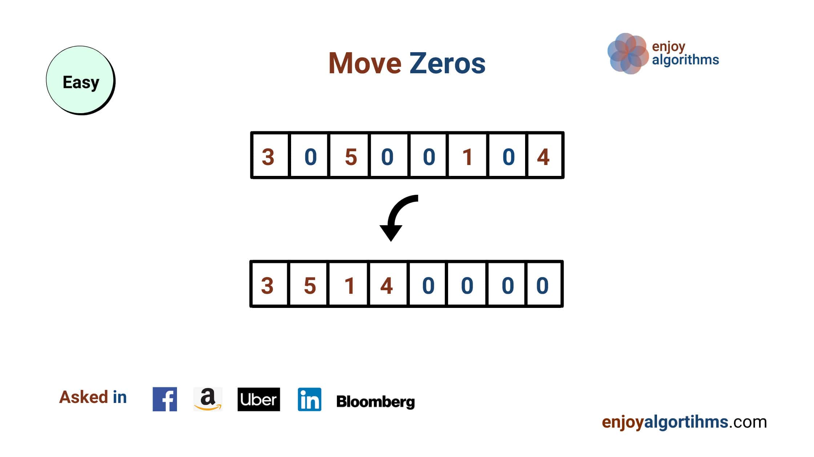

# Chuyển Các Số 0 Về Cuối Mảng



- Mức độ: Dễ
- Hỏi bởi: Facebook, Amazon, Uber, LinkedIn, Bloomberg
- Ghi nhớ: một vấn đề thú vì có thể giải quyết bằng cách dùng lặp hai con trỏ dịch chuyển về cùng một hướng.

## Hiểu vấn đề

Cho một mảng số nguyên X[], trong đó một vài phần tử là 0 và một vài phần tử khác 0. Viết một chương trình dịch tất cả số 0 về cuối mảng.

### Ví dụ 1:

Input X[] = [4, 8, 6, 0, 2, 0, 1, 15, 12, 0]

Output X[] = [4, 8, 6, 2, 1, 15, 12, 0, 0, 0]

### Ví dụ 2:

Input: X[] = [0, 3, 5, 9, 0, 0, 23, 2]

Output: X[] = [3, 5, 9, 23, 2, 0, 0, 0]

## Giải pháp

- Brute force sử dụng hai vòng lặp và không gian bổ sung
- Sử dụng hai con trỏ và hai vòng lặp
- Sử dụng hai con trỏ và một vòng lặp

### 1. Brute force

#### Ý tưởng

Ý tưởng cơ bản là dùng một bộ nhớ bổ sung kích thước n, duyệt qua mảng đầu vào và lưu trữ tất cả phần tử khác 0. Sau đó, ta điền vào các vị trí còn lại của bộ nhớ bổ sung với giá trị 0 và trả về.

Giải pháp này sự bảo toàn thứ tự phần tử nhưng có hai hạn chế:
1. Không phải giải pháp thay thế tại chỗ, cần bộ nhớ bổ sung.
2. Ta phải dùng hai vòng lặp cho bộ nhớ bổ sung.

#### Các bước

1. Khai báo mảng Y[n] để lưu trữ output.
2. Khởi tạo hai vòng lặp: vòng lặp với con trỏ `i` duyệt qua mảng X[], và con trỏ `j` lưu trữ giá trị cho mảng `Y[]`.
3. Bây giờ ta chạy vòng lặp `i` từ 0 đến n-1 và duyệt mảng đầu vào. Khi tìm thấy giá trị khác 0, ta lưu nó tại Y[j] và tăng cả i và j. Ngược lại ta chỉ tăng i. Kết thúc vòng lặp, Y lưu trữ tất cả giá trị khác 0.
4. Sau đó ta duyệt qua Y[] từ vị trị j đến n và lưu giá trị 0 tại các chỉ mục còn lại. Cuối cùng trả về Y[].

```c
int [] moveZeroesEnd(int X[], int n) {
    int Y[n];
    int j = 0;
    for (int i = 0; i < n; i++) {
        if (X[i] != 0) {
            Y[j] = X[i];
            j++;
        }
    }
    while (j < n) {
        Y[j] = 0;
        j++;
    }
    return Y;
}
```

#### Phân tích

Độ phức tạp thời gian trong trường hợp tệ nhất = Độ phức tạp thời gian duyệt X[] và lưu phần tử khác 0 vào Y[] + Độ phức tạp thười gian của việc lưu 0 vào Y[] = O(n) + O(n) = O(n). 

Độ phức tạp không gian là O(n), vì ta cần một mảng Y[] bổ sung

### 2. Hai con trỏ và hai vòng lặp

#### Ý tưởng

Câu hỏi lúc này là ta có thể tối ưu hoá giải pháp bằng cách giảm độ phức tạp không gian hoặc giải quyết vấn đề tại chỗ?

Ta có thể sử dụng cách tiếp cận trên, nhưng không cần lưu trữ không gian bổ sung bằng cách chuyển tất cả phần tử khác 0 lên đầu mảng và điền các vị trí còn lại là 0.
1. Ta duyệt mảng đầu vào với hai con trỏ là i và j. Trong đó i dùng để duyệt mảng và j để theo dõi chỉ mục khác không cuối cùng.
2. Khi ta bắt gặp phần tử khác 0 tại i, ta chuyển nó lên chỉ mục j. `if (X[i] != 0), X[j] = X[i]`. Ta cũng sẽ tăng i và j lên 1.
3. Ngược lại, ta chuyển con trỏ i lên 1.
4. Sau vòng lặp tât cả phần tử từ X[0...j-1] đều khác không. Khi đó ta duyệt lại mảng X lần nữa và điền 0 từ vị trị j đến n-1.

Giải pháp này vẫn duy trì thứ tự phần tử nhưng có hạn chế là phải dùng đến hai vòng lặp.

#### Mã giả

```c
void moveZeroEnd(int X[], int n) {
    int j = 0;
    for (int i = 0; i < n; i++) {
        if (X[i] != 0) {
            X[j] = X[i];
            j++;
        }
    }
    while (j < n) {
        X[j] = 0;
        j++;
    }
}
```

#### Phân tích

Độ phức tạp thời gian trong trường hợp tệ nhất = Độ phức tạp thời gian duyệt X[] và lưu phần tử khác 0 vào Y[] + Độ phức tạp thười gian của việc lưu 0 vào Y[] = O(n) + O(n) = O(n). Độ phức tạp không gian là O(1) vì đây là giải pháp thay thế tại chỗ.

