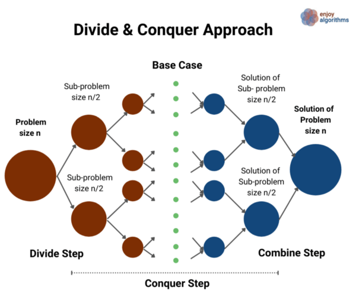

# Merge Sort


- Mức độ: Trung bình
- Hỏi bởi: Microsoft, Amazon, Goldman Sachs, Qualcomm, Bloomberg, Paytm.

## Giới thiệu về merge sort

Merge sort là một thuật toán sắp xếp phổ biến sử dụng kỹ thuật chia để trị để sắp xếp một mảng (hoặc danh sách) số nguyên (hoặc chuỗi ký tự). Ở đây có các lý do tuyệt vời để bạn học thuật toán này:
- Một trong những thuật toán sắp xếp nhanh nhất với độ phức tạp thời gian là **O(nlogn)**.
- Thuật toán tốt nhất cho sắp xếp danh sách liên kết với độ phức tạp thời gian là O(nlogn).
- Thuật toán sử dụng kỹ thuật chia để trị cho giải quyết vấn đề. Ta có thể sử dụng cách tương tự để giải quyết các vấn khác.
- Thuật toán tốt nhất cho thiết kế và phân tích đệ quy.
- Là ý tưởng tuyệt vời cho học cách tiếp cận hai con trỏ (two pointers). Ở đây cả hai con trỏ dịch chuyển cùng hướng để xây dựng các phần riêng biệt của giải pháp. 



## Ý tưởng chia để trị

Ta cần sắp xếp lại một mảng **A[l..r]** có n số nguyên, bắt đầu từ chỉ mục l và kết thúc ở chỉ mục r. Câu hỏi đầu tiên là ta có thể sắp xếp với cỡ n bằng các giải pháp của các vấn đề con nhỏ hơn hoặc áp dùng kỹ thuật chia để trị?


Nếu quan sát sơ đồ trên, thì ý tưởng chia để trị như sau:
- **Divivde part**: chia vấn đề có kích thước n thành hai vấn đề con có kích thước giống nhau là n/2. Ta có thể dễ dàng chia vấn đề bằng cách tính **mid**.
    + Vấn đề con bên trái: sắp xếp A[] từ `l` đến `mid`.
    + Vấn đề con bên phải: sắp xếp A[] từ `mid+1`  đến `r`.
- **Conquer part**: bây giờ, ta giải quyết hai vấn đề con theo cách đệ quy và sẽ có bốn vấn đề con nhỏ hơn nữa. Ta không cần lo lắng về giải pháp cho các vấn đề con vì đệ quy sẽ là điều đó.
- **Combine part**: ta gộp các phần đã sắp xếp để tạo thành mảng đã sắp xếp hoàn chỉnh. Nói cách khác ta gộp các giải pháp cho hai vấn đề con kích thước n/2 để giải quyết vấn đề kích thước n.

## Triển khai

Ta có hàm `mergeSort(int A[], int l, int r)` sắp xếp mảng A[] với left và right là hai tham số đầu vào.
- **Divide part:** ta tính giá trị của mid, `mid = l + (r-l)/2`.
- **Conquer part 1:** ta gọi cùng hàm với `mid` là tham số `right` và đệ quy để sắp xếp phần bến trái với kích thước n/2, `mergeSort(A, l, mid)`.
- **Conquer part 2:** ta gọi cùng hàm với `mid+1` là tham số `left` và đệ quy để sắp xếp phần bến phải với kích thước n/2, `mergeSort(A, mid+1, r)`.
- **Combine part:** trong hàm `mergeSort()`, ta sử dụng hàm `merge(A, l, mid, r)` để gội các phần nhỏ hơn đã sắp xếp thành một mảng đã sắp xếp cuối cùng.
- **Base case:** nếu ta rơi vào trường hợp `l == r` khi đệ quy, tức là mảng con đó chỉ có một phần tử, đã sắp xếp. Thế nên đệ quy sẽ không tiến xa hơn mà trả về từ đây. Nói cách khác, mảng con một phần tử là phiên bản nhỏ nhất của vấn đề đã sắp xếp.

*Lưu ý*: ta dùng l + (r-l)/2 thay vì (l + r)/2 để tránh overflow khi l và r quá lớn.

## Mã giả

```c
void mergeSort(int A[], int l, int r) {
    if (l >= r)
        return;
    int mid = l + (r-l)/2;
    mergeSort(A, l, mid);
    mergeSort(A, mid + 1, r);
    merge(A, l, mid, r);
}
```

## Triển khai thuật toán gộp

### 1. Sử dụng hai con trỏ

Sau bước conquer, cả hai phần `A[l..mid]` và `A[mid+1...r]` sẽ được sắp xếp. Ta cần kết hợp các giải pháp của hai vấn đề con để xây dựng giải pháp cho vấn đề lớn. 

Nếu ta lưu giá trị của cả hai phần đã sắp xếp của A[] vào một mảng bổ sung  có kích thước n/2 (X[] và Y[]), sau đó ta chuyển đổi vấn đề thành gộp hai mảng đã sắp xếp X[] và Y[] thành mảng lớn A[] . Sử dụng thuộc tính của mảng đã sắp xếp và so sánh từng giá trị một, ta có thể tạo mảng lớn đã sắp xếp A[]. 

Ta có thể dùng hai con trỏ độc lập là `i` và `j` để duyệt qua mảng `X[]` và `Y[]` từ vị trị bắt đầu. Ta so sánh từng phần tử một và đặt giá trị nhỏ hơn vào mảng A[]. Một cách khác có thể nghĩ đến là sau mỗi lần so sánh ta thêm phần tử vào output và xây dựng một phần mảng A[] đã sắp xếp. Nhưng một câu hỏi quan trọng là liệu ta có thể gộp hai phần đã sắp xếp vào đúng vị trí không? Hay thử với thao tác hoán đổi và so sánh để có được cái nhìn rõ ràng.

#### Các bước triển khai 

**Bước 1:** Cấp phát bộ nhớ và sao chép dữ liệu

- Ta cấp phát hai mảng mở rộng có kích thước bằng với phần bên trái và bên phải của mảng. Kích thước phần bên trái là `mid - l + 1`, và bên phải là `r - mid`.

```c
int n1 = mid - l + r;
int n2 = r - mid;
int X[n1], Y[n2];
```

- Sau đó ta sao chép cả hai phần vào mảng mở rộng

```c
for (int i = 0; i < n1; i++)
    X[i] = A[l+i];

for (int j = 0; j < n2; j++)
    Y[j] = A[mid + 1 + j];
```

**Bước 2:** Bây giờ ta bắt đầu quá trình gộp sử dụng hai con trỏ
- Ta khởi tạo con trỏ i, j và k để duyệnt mảng X[], Y[] và A[]. i=0, j=0, k=l. 
- Bây giờ ta chạy vòng lặp cho đến cuối mảng. `while(i < n1 && j < n2)`
- Bước đầu tiên của vòng lặp ta so sánh X[0] và Y[0] và đặt phần tử nhỏ nhất vào A[0]. Trước khi đến vòng lặp tiếp theo ta tăng k lên một đơn vị.
- Ta tìm tục thực hiện trên ba mảng với ba con trỏ, mỗi bước đều so sánh X[i] và Y[j] đặt cái nhỏ hơn vào A[k] rồi tăng k. Tuỳ vào kết quả mà ta sẽ tăng i hay j. Nếu `if (X[i] <= Y[j])` là true ta sẽ tăng i ngược lại thì tăng j.

```c
int i = 0, j = 0, k = l;
while (i < n1  && j < n2) {
    if (X[i] <= Y[j]) {
        A[k] = X[i];
        i++;
    } else {
        A[k] = Y[j];
        j++;
    }
    k++
}
```


**Bước 3:** Kết thúc vòng lặp và điều kiện dừng

Vòng lặp sẽ dừng khi bất kỳ con trỏ nào đến cuối mảng của nó (i = n1 hay j = n2). Ở giai đoạn này, ta sẽ có hai trường hợp cho điều kiện dừng:
- **Điều kiện dừng 1** vòng lặp sẽ dùng nếu j = n2, khi ta đến cuối mảng Y[], và tất cả các giá trị của Y[] đã được đặt vào A[]. Nhưng vẫn còn vài phần tử trong X[] cần đặt vào A[]. Ý tưởng sẽ là: các giá trị này lớn hơn tất cả giá trị còn lại trong A[], do đó ta chỉ sao chép lại giá trị của X[] trong mảng A[] là xong.

```c
while (i < n1) {
    A[k] = X[i];
    i++;
    k++;
}
```


- **Điều kiện dừng 2** vòng lặp sẽ dùng nếu i = n1, khi ta đến cuối mảng X[], và tất cả các giá trị của X[] đã được đặt vào A[]. Nhưng vẫn còn vài phần tử trong Y[] cần đặt vào A[]. Ý tưởng sẽ là: các giá trị này lớn hơn tất cả giá trị còn lại trong A[], do đó ta chỉ sao chép lại giá trị của Y[] trong mảng A[] là xong.

```c
while (j < n2) {
    A[k] = Y[j];
    j++;
    k++;
}
```


### Mã giả

```c
void merge(int A[], int l, int mid, int r)
{
    int n1 = mid - l + 1;
    int n2 = r - mid;
    int X[n1], Y[n2];

    for (int i = 0; i < n1; i++)
        X[i] = A[l + i];
    
    for (int j = 0; j < n2; j++)
        Y[j] = A[mid + 1 + j];

    int i = 0, j = 0, k = l
    while (i < n1 && j < n2) {
        if (X[i] <= Y[j]) {
            A[k] = X[i];
            i++;
        }
        else {
            A[k] = Y[j];
            j++;
        }
        k++;
    }

    while (i < n1) {
        A[k] = X[i];
        i++;
        k++;
    }
    while (j < n2) {
        A[k] = Y[j]
        j++;
        k++;
    }
}
```

### Phân tích

Ta có độ phức tạp thời gian cho mỗi bước quan trọng và lấy tổng để tính độ phức tạp thời thời gian tổng thể.
- Quá trình cấp phát = O(1)
- Quá trình sao chép = O(n1) + O(n2) = O(n1+n2) = O(n)
- Vòng lặp trong trường hợp tệ nhất: O(n1+n2) = O(n)
- Điều kiện dừng 1 trong trường hợp tệ nhất: O(n1)
- Điều kiện dừng 2 trong trường hợp tệ nhất: O(n2)
- Độ phức tạp thời gian tổng thể: O(1) + O(n) + O(n1) + O(n2) = O(n)

Nếu chúng ta quan sát kỹ, thì độ phức tạp thời gian của thuật toán gộp phụ thuộc vào độ phức tạp thời gian của vòng lặp gộp, so sánh, gán và tăng là các hoạt động quan trọng. Có thể có hai quan điểm khác nhau để hiểu phân tích này:
- Quan điểm 1: tại mỗi bước của vòng lặp while, chúng ta tăng con trỏ i hoặc j. Nói cách khác, chúng ta cần truy cập từng phần tử của cả hai mảng nhỏ hơn ít nhất một lần.
- Quan điểm 2: ở mỗi bước lặp, ta đặt từng phần tử của các mảng đã sắp xếp nhỏ hơn để xây dựng mảng được sắp xếp lớn hơn A[].


Độ phức tạp không gian = không gian bổ sung cho lưu phần bên trái + không gian bổ sung cho lưu phần bên phải = O(n1) + O(n2) = O(n1+n2) = O(n).

### Hình dung với ví dụ


### Phân tích độ phức tạp

Giả sử T(n) là trường hợp tệ nhất cho merge sort với n số nguyên. Khi n > 1 (sắp xếp một phần tử ở thời gian hằng số), ta có thể chia độ phức tạp thời gian thành:
- **Divide part** độ phức tạp của phần chi là O(1) vì tính chỉ mục mid ở thời gian hằng số.
- **Conquer part** ta giải quyết hai vấn đề con bằng đệ quy, mỗi phần có kích thước n/2. Thế nên độ phức tạp thời gian cho mỗi vấn đề con là T(n/2) và tổng thể là 2T(n/2).
- **Combine part** trong tính toán này, trường hợp tệ nhất là O(n).

Với tính toán T(n), ta có thể thêm độ phức tạp thời gian voà các phần divide, conquer và combine. => T(n) = O(1) + 2T(n/2) + O(n) = 2T(n/2) + O(n) = 2T(n/2) + cn.
- T(n) = c, nếu n = 1
- T(n) = 2T(n/2) + cn, nếu n > 1

